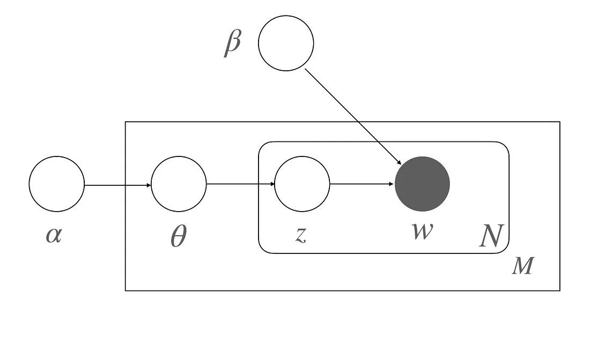
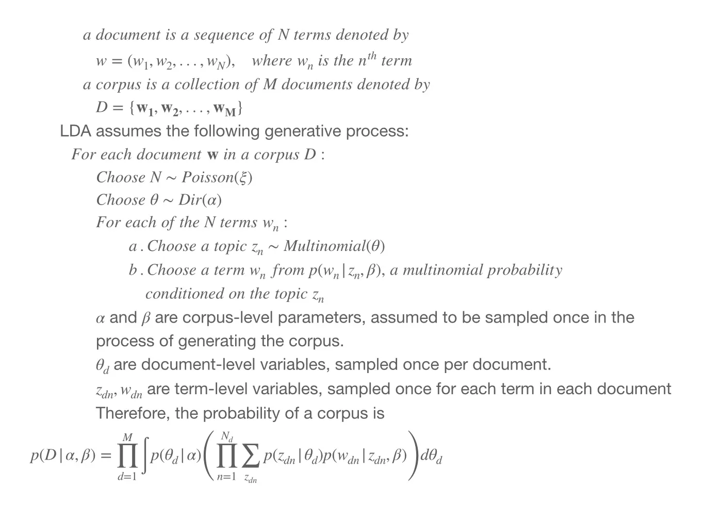

# LDA(Latent Dirichlet Allocation)

- generative probablilistic model
- to identify coherent topics
- 3단계 계층적 베이지안 추론 모델
- topic-term, document-topic 분포를 알아낸다.
- 가정

  - 각각의 document가 여러 토픽의 부분집합이라고 가정한다.
  - 각각의 토픽은 무한한 토픽 분포의 혼합된 부분집합이라고 가정한다.

- 결과가 deterministic 하지 않기 때문에, 돌릴 때마다 다른 결과가 나올 수 있다.

## 잠재적

LDA는 결국, 확률적 잠재 의미 분석(Probabilistic Latent Semantic Analysis - pLSA)의 확장이다. 여기서 "잠재적"의 의미는, 문서의 topic을 몰랐던 상태에서도, 하나의 토픽에 의해 글이 작성되었다고 가정하고 몰랐던 "연관"(apriori)등을 찾음을 의미한다.

## Dirichlet

문서에서 토픽의 분포, 토픽에서 단어의 분포를 분석한다. 이를 "**디리클레(Dirichlet)**" 라고 하며 원문에서 문서와 토픽을 plate(이미지 상에서 박스)에 비유해 나타낸 도표가 다음과 같다.

 
 > “The boxes are “plates” reprsenting replicates. the outer plate represents documents, while the inner plate represents the repeated choice of topics and terms within a document.”

