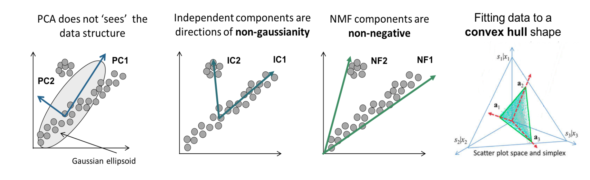
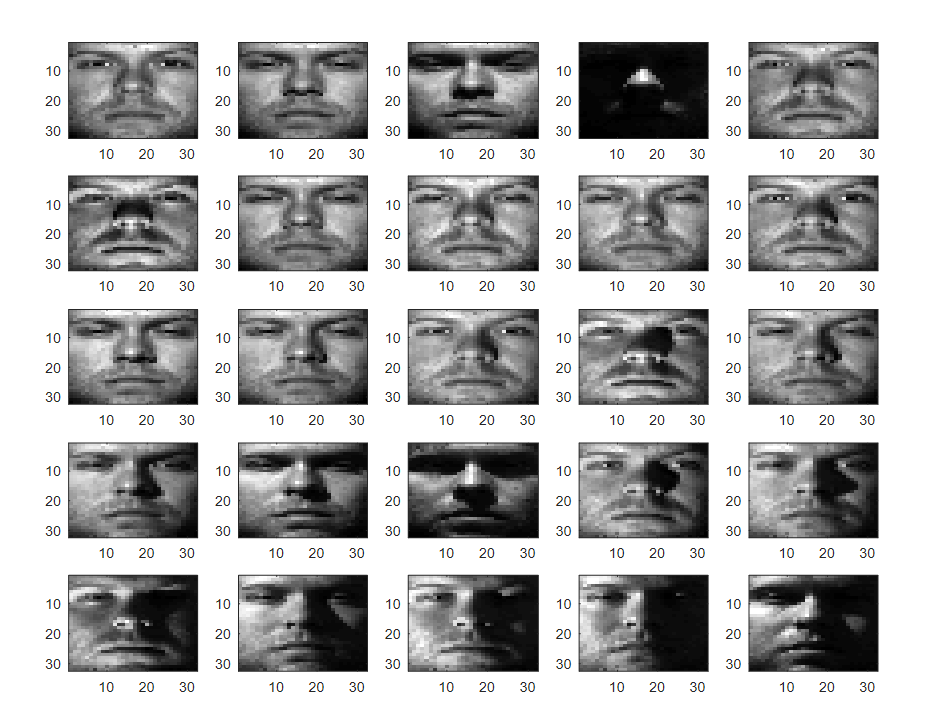
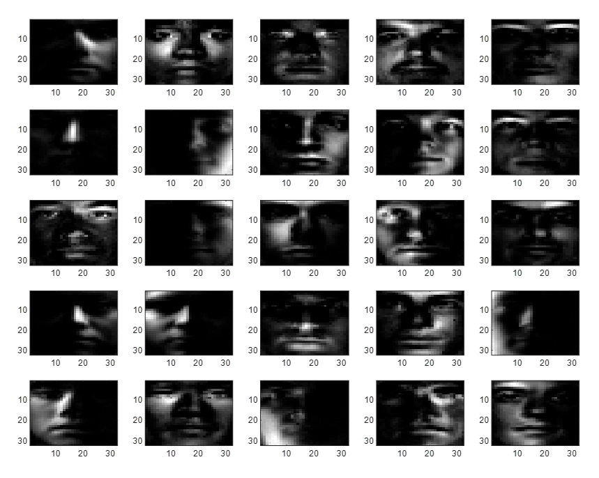
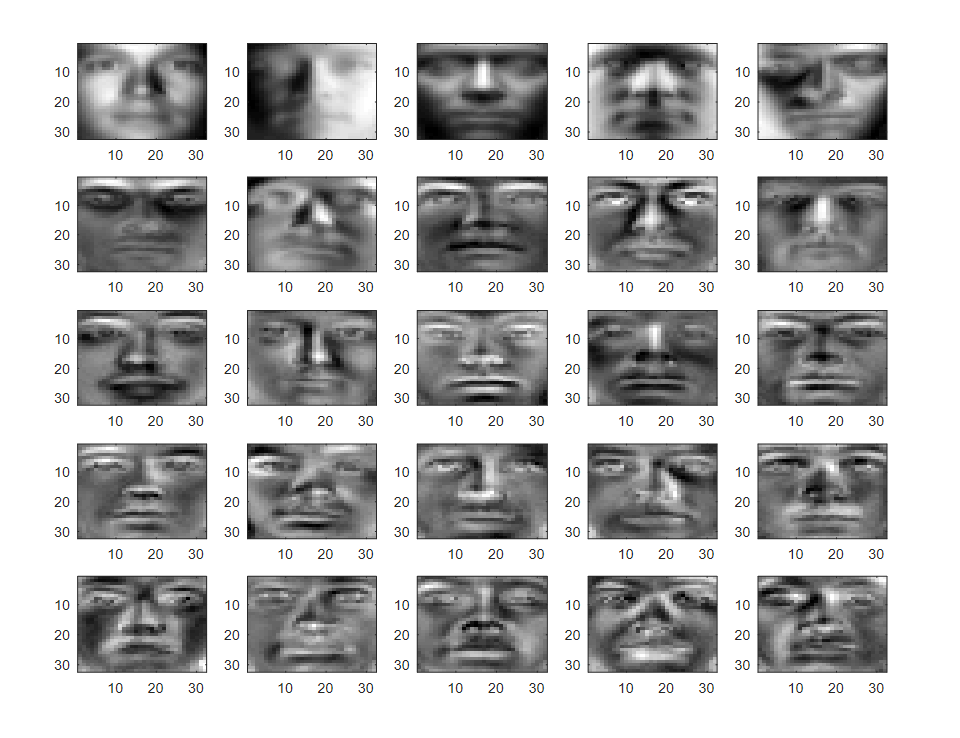

# NMF(Non-negative Matrix Factorization)

- 음수 미포함 행렬 분해
- 음의 원소가 없는 행렬을 두 개의 음의 원소가 없는 행렬로 나눈다.

- 행은 topic, 열은 문서가 된다.
- 가정:
  - 각각의 document는 topic의 선형 조합이고,
  - 각각의 topic은 term들의 선형 조합이다.
- 차원 축소와 feature 추출이 목표이다.
- 원본 행렬이 feature matrix와 coefficient matrix로 분해된다.
- 작은 데이터셋과 짧은 문장에 적합하다.

## Methodology

https://angeloyeo.github.io/2020/10/15/NMF.html 를 보고 정리했습니다.

> NMF 는 본래 행렬 분해 기법이다. 특별히 자연어 처리용으로 개발된 것도 아니고, 오히려 이미지 처리에서 PCA 등과 비교하는 자료들이 더 많다.

원래 데이터 행렬 $X$ 가 주어졌을 때, 이를 Feature의 개수 $r$ 을 기준으로 두개의 행렬로 쪼개는 것을 목표로 한다.

$$
X_{m \times n} = W_{m \times r} * H_{r \times n}
$$

이름에서 알 수 있듯이 비음행렬을 비음행렬들로 나누며, 그 과정에서도 비음을 보장한다. 따라서 "비음"의 특성이 의미를 갖는 픽셀의 RGB 값과 같은 경우에 적용하기 좋다. 이런 점이 PCA나 SVD와 다른 점인데, 또 하나의 다른 점은 그 둘은 feature vector들 간의 직교성을 보장하고, 그 점을 적극 활용하지만, NMF 는 그렇지 않다. 따라서, 데이터의 형태를 보고 어떤 행렬 분해를 사용하는 것이 유리할지 선택하는 것이 데이터 분석가의 역량이지 않을까 싶다.

[출처](https://urszulaczerwinska.github.io/DeconICA/DeconICA_introduction.html)

- 원본

- NMF Feature 추출

- PCA Feature 추출

### Algorithm

#### Objective Function

목적함수는 다음과 같다. 특이하게도 Frobenius Norm을
사용한다.

$$
min ||X-WH||^{2}_{F}
$$

#### Frobenius Norm

$$
||A||_{F}^{2} = 모든 원소의 제곱의 합 = tr(A^TA) = 특이값 제곱의 합
$$

[출처](https://blog.naver.com/skkong89/221720871900)

#### Update Rule

Update Rule은 다음과 같다.
구하는 과정에서 음의 가능성이 있는 식이 도출되는데, Learning Rate를 Data-driven한 값으로 특정해 그를 예방한 점이 특이하다.

$$

H:= H \circ \frac{W^TX}{W^TWH}

$$

$$
W:= W \circ \frac{XH^T}{WHH^T}
$$
