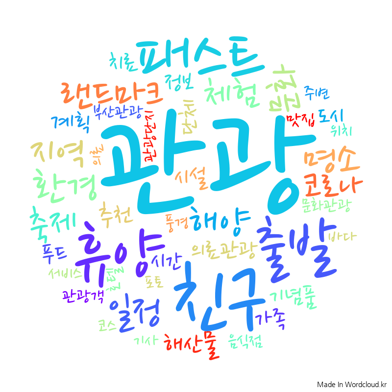
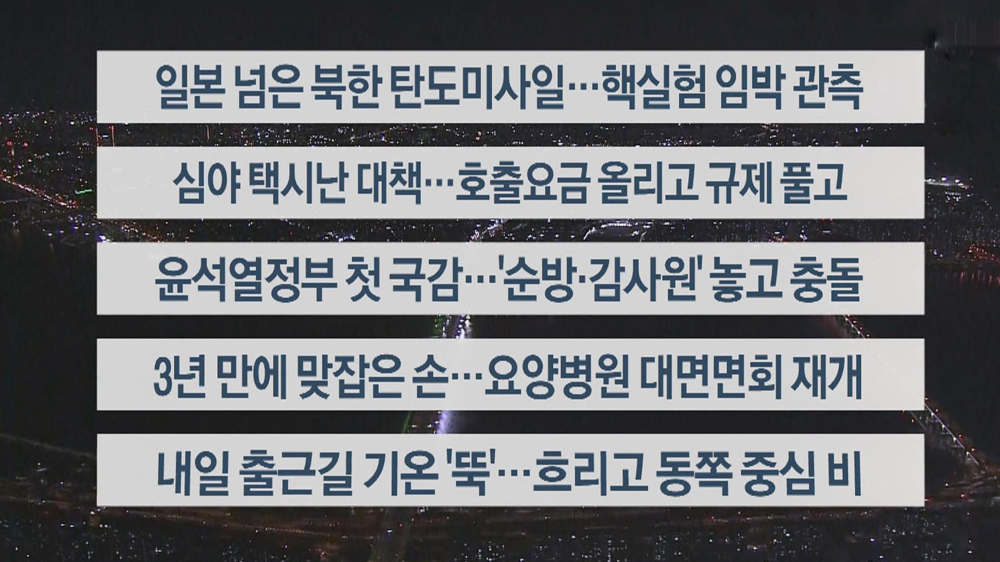
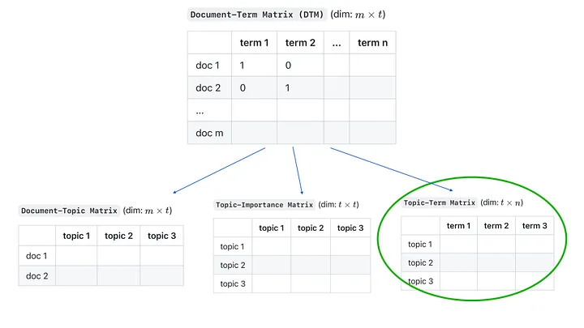

# Topic Modeling

SSAFY 11기 특화 프로젝트 "꿀모닝"에서

1. 뉴스 기사 카테고리

2. 개인 관심사 (오픈토픽 ex. _"유럽에 사는 고양이"_)

를 클라이언트가 설정하면, 그에 맞는 뉴스기사 혹은 구글 검색결과를 크롤링해 그 안에 담긴 세부 Term 들을 토픽 모델링해 보여주기로 했다. 예를 들어, "연예" 카테고리를 사용자가 선택했다면, 그 중에 "카리나"가 얼마나 주요한 토픽인지를 사용자가 가늠할 수 있도록 하는 것이 목표이다.

그 결과물은 Word Cloud나, 뉴스 기사 헤드라인 모음의 형식으로 보여주는 것을 계획하고 있다.

## Model

Topic Modeling의 목적은 결국, Document-Term 으로 구성된 matrix를 Document-topic, Topic-Importance, Topic-Tem 등으로 분해하는 것에 있다. 그를 위한 알고리즘으로, [Topic modeling algorithms](https://medium.com/@m.nath/topic-modeling-algorithms-b7f97cec6005)에서는 LDA, NMF, BERTopic 을 언급하여 각각에 대해 자세하게 알아보려 한다.

### BERTopic

### LDA

### NMF

## Reference

1. https://wordcloud.kr/470451

2. https://m.yonhapnewstv.co.kr/news/MYH20221004022000038

3. https://medium.com/@m.nath/topic-modeling-algorithms-b7f97cec6005
